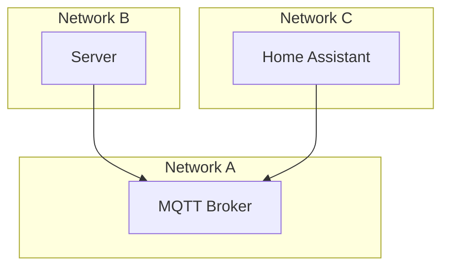

# ReSyMo – Remote System Monitoring

An itch to a scratch of having a few servers, but no dashboard to monitor their status.

## Getting started

* Install Home Assistant on one machine
* Set up an MQTT broker (see [Architecture](#current-architecture) below)
* Deploy the ReSyMo agent on machines you want to monitor

## Goals and non-goals

The goal is to have a small tool, allowing to get an overview of a handful of servers. Re-using components where
possible, and implementing things when necessary. The overall setup should be straightforward and follow existing
patterns.

## Current architecture

The idea is to use [Home Assistant](https://www.home-assistant.io/) as a central hub for bringing data together and
visualizing it. To connect servers (which may or may not run in public networks) with Home Assistant (which most likely
is not running on a public network), and MQTT broker is being used to bridge connectivity. Home Assistant also has an
HTTP API for publishing data to it. However, that would mean opening up external access to Home Assistant for servers
which are running on a public network. Home Assistant also has an MQTT integration including auto-discovery of devices.

## FAQ

### Why Home Assistant

While Home Assistant might not be a network monitoring tool, it is a great smart home tool. And for a smaller set of
servers, it fits quite well. Including visualization, automation, timeseries data, mobile phone app, notifications, …

### Why not XYZ?

I've been looking around for quite a while. Yes, there are some solutions. Most of them are just way too complex for
monitoring some basic information of a handful of machines. Some of them are quite invasive.

If you find something better, please let me know.
